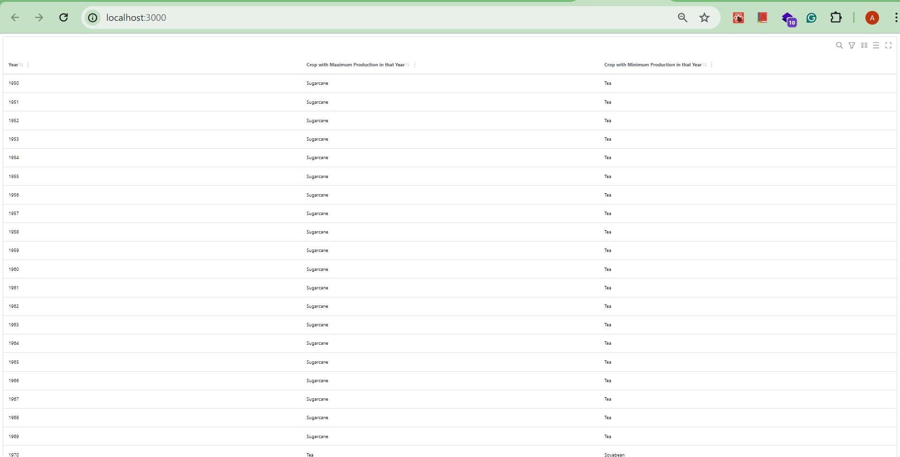
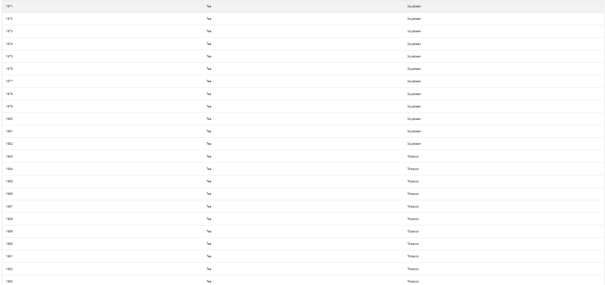
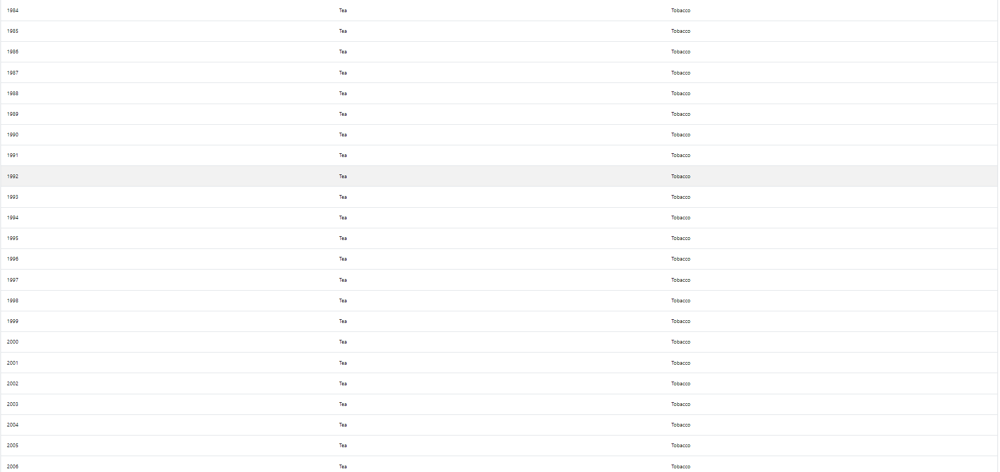
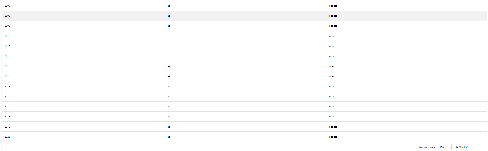

**About Data Analysis Project.**

In this task some analytics is done over the Indian Agriculture dataset which has made available by National Data and Analytics Platform, NITI Aayog.

1) Minimum and Maximum Crop Production has been calculated per year between 1950 to 2020, as shown in table below

2) Average yeild of Crop and average cultivation area required for crop is calculated for each crop between 1950 to 2020, as shown below in table

**Instructions to install and run the project.**
1) To install dependencies, use **yarn**
2) To run in the localhost, use **yarn start**
3) To create a build production, use **yarn build**
